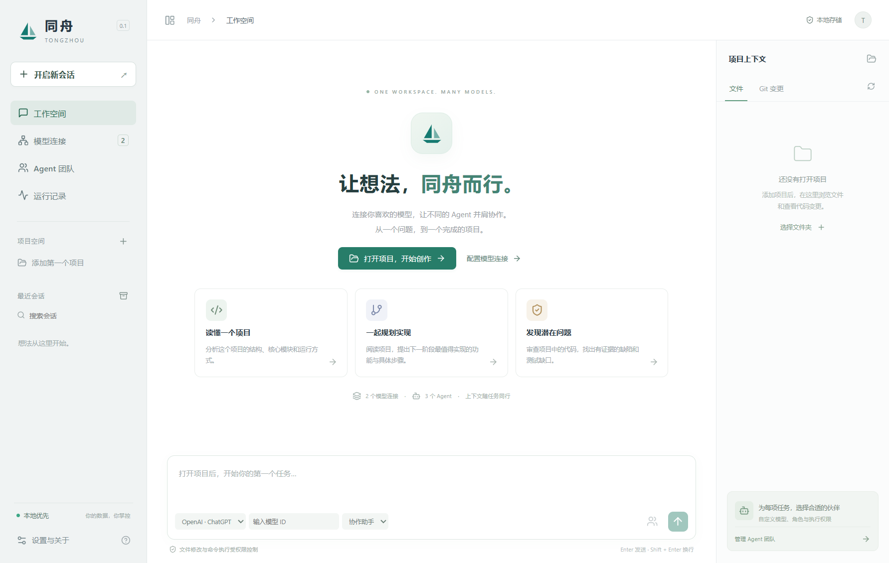

<p align="center"></p>
<h1 align="center">同舟 Tongzhou</h1>
<p align="center"><strong>多模型协作，一个工作台。</strong><br/>One workspace. Many models.</p>
<p align="center">Windows · macOS · Local-first · Apache-2.0</p>
<p align="center">
  <a href="https://github.com/OrenZhang/tongzhou">源码</a> ·
  <a href="https://github.com/OrenZhang/tongzhou/releases">版本发布</a> ·
  <a href="https://github.com/OrenZhang/tongzhou/issues">问题反馈</a> ·
  <a href="CONTRIBUTING.md">参与贡献</a>
</p>

同舟是一个开源桌面 AI 编程工作台。通过 Codex、Kimi Code、MiniMax Code 官方引擎接入账号授权，通过原生 API 适配器接入其他模型，在一个项目和连续会话中分析、编写、验证代码。

也可以直接开始普通聊天，无需打开项目、无需选择专属 Agent。需要不同模型接手时，在当前会话切换连接与模型，继续使用已有对话和工具记录。

**当前版本：0.3.0。** 本版增加 MCP / Skills 管理、电脑控制和跨模型会话交接修复，功能与边界见下方。独立项目，与 OpenAI、CC Switch 无官方从属关系。

Windows x64 已完成本地打包和桌面测试；macOS 已有适配与构建工作流，尚未实机验收。源码、CI 配置与公开安装包是不同交付阶段，请以 [Releases](https://github.com/OrenZhang/tongzhou/releases) 实际列出的产物为准；没有公开安装包时可按下方说明从源码启动。同舟不包含 Codex 桌面端专有插件。



> 上图为工作空间界面示例，当前版本还增加了「插件与工具」页面。

## 导航

[本地开发](#本地开发) · [第一次使用](#第一次使用) · [认证与执行模式](#认证与执行模式) · [插件与电脑控制](#插件skills-与电脑控制) · [同一会话切换模型](#同一会话切换模型) · [测试与安装包](#测试与安装包) · [当前验证状态](#当前验证状态)

## 已实现

- **多模型接入**：OpenAI Chat Completions、Responses、Anthropic Messages、Gemini 流式 API；支持自定义 URL、API Key、Bearer Token 和无认证的本地服务。
- **Codex 原生执行**：内置固定版本 Codex CLI，通过 App Server 调用官方 ChatGPT 登录、文件操作、终端、沙箱和审批。使用同舟独立的配置目录。
- **Kimi / MiniMax 账号授权**：内置官方 CLI，通过 ACP 接入设备授权、账号验证、退出、模型目录、流式对话与工具审批。国内与国际账号可选；凭据由官方引擎在同舟独立目录管理，续期也由引擎处理。
- **连续会话**：本地 SQLite 持久化消息、工具结果、项目和运行记录；在轮次间切换模型，交接可移植历史；重启可继续。
- **普通聊天**：无需项目目录即可直接发送消息、切换模型、配置 Agent 和发起团队讨论。“开启新会话”默认创建普通聊天，点击项目或打开文件夹才创建项目会话。直接 API 普通聊天不开放本地文件和命令工具；Codex 使用独立空目录与只读执行策略。
- **直接 API 编程工具**：列目录、读文件、审批后写文件、审批后执行命令；中文路径、路径边界检查、符号链接拒绝、写入冲突检测。
- **Agent 配置**：角色指令、独立模型/连接、只读或审批权限、API 执行轮次上限。
- **并行协作**：最多 3 个只读 Agent 独立分析，将结果汇回父会话；可分别查看子会话、失败与用量。
- **CC Switch 导入**：读取 `cc-switch.db` 或 JSON 供应商配置，确认后导入地址、模型与 API 密钥。源文件只读，不接管或修改其他应用配置。
- **工作区界面**：项目文件浏览、只读预览、Git diff、会话搜索/重命名/归档/恢复、Markdown 导出、运行状态和实际返回的 Token 用量。
- **本地凭据保护**：API 密钥由 Electron safeStorage 使用系统能力加密；界面仅得到是否已配置，不得到保存的密钥。安全存储不可用时拒绝保存。
- **MCP / Skills 管理**：stdio、Streamable HTTP 插件接入与工具发现；导入 Skill 指令和附属文本，按 Agent 启用。
- **电脑控制**：窗口列表、截图、点击、输入、快捷键、滚动和拖动；每次调用审批，支持停止全部任务。

## 本地开发

开发安装使用 Node.js **22.19+ 的 22 LTS 系列**（CI 使用 Node 22；内置引擎固定携带 Node 22.23.3）、npm、Git。Windows 使用 PowerShell；macOS 需要 Xcode Command Line Tools 用于打包。

```bash
git clone https://github.com/OrenZhang/tongzhou.git
cd tongzhou
npm ci
npm run dev
```

生产构建和运行：

```bash
npm run build
npm start
```

首次安装依赖时下载 Electron、Codex、Kimi Code、MiniMax Code 和当前平台的 Node 运行时；正式安装包内置这些组件，用户无需安装 Node 或 CLI。官方软件包由 npm/GitHub 分发；若网络受限，请使用自己信任的网络或组织内镜像。

### 隔离开发数据

默认使用 Electron 的应用数据目录。开发与预览可通过 `TONGZHOU_USER_DATA` 指定独立目录，避免混用日常账号和会话。

Windows PowerShell：

```powershell
$env:TONGZHOU_USER_DATA = Join-Path $PWD 'work/tongzhou-dev-profile'
npm run dev
```

macOS：

```bash
TONGZHOU_USER_DATA="$PWD/work/tongzhou-dev-profile" npm run dev
```

`work/`、测试输出、数据库、日志、缓存、`.env` 和编辑器本地设置均已忽略。源码测试、脱敏 fixture、锁文件、构建资源和 GitHub 工作流仍纳入版本管理。不要把真实密钥、会话、截图或账号导出写进源码目录；详见 [贡献指南](CONTRIBUTING.md)。

## 第一次使用

1. 在 **模型连接** 添加服务，确认接口协议、Base URL 和认证方式，再获取并选择模型。账号连接从供应商管理进入「认证」，只显示该供应商的授权模块。Base URL 应为协议根路径，例如 `https://api.example.com/v1`，不要填完整的 `/chat/completions`。
2. 点击“保存连接并获取模型”。会话与 Agent 的模型选择框支持搜索、点选与刷新，打开时自动读取服务模型目录，获取结果保存在本地。服务未提供模型目录时，可搜索后使用自定义 ID；连接配置中的手动列表收在“高级”选项内。**保存并测试调用会产生一次真实模型调用，可能计费。**
3. 若使用 ChatGPT，在 **设置与关于** 选择“ChatGPT 浏览器登录”或“设备码登录”。设备码方式会显示一次性代码，点击“打开授权页面”后登录并输入代码；若账号要求，请先在 ChatGPT 安全设置或工作区权限中启用设备码登录。同舟接收授权结果后自动读取账号和同步模型列表；也可取消或手动刷新状态。之后使用 **OpenAI · ChatGPT** 连接。模型权限取决于账号，模型列表不是权益检查。
   Kimi / MiniMax 也在 **设置与关于** 登录，选择国内或国际账号、点击登录并打开官方授权页。成功后使用 **Kimi · 账号授权** 或 **MiniMax · 账号授权**；无需输入 API Key。切换账号地区前先退出。
4. 在输入框选择连接和模型，直接发送消息即可开始普通聊天。无需选择 Agent；需要专属角色时，在“Agent 团队”点击“用于当前会话”，输入框上方会显示可移除的角色提示卡。需要读取或修改项目文件时再打开项目。Agent 配置提供默认值，之后手动选择的连接与模型优先。
5. 阅读写文件或执行命令的审批内容，再选择批准或拒绝。停止按钮终止当前运行，不回滚已完成的文件修改。
6. 需要多视角分析时，输入任务后点击输入框右侧的团队图标，选择 1–3 位 Agent。
7. 需要公共插件或电脑操作时，进入 **插件与工具 → 配置默认助手工具**，或编辑对应 Agent 的工具权限。仅添加插件或导入 Skill 不会自动向所有 Agent 开放。

账号经验证后显示已授权标志；仅打开授权网页不代表授权成功。保存连接、获取模型目录和测试推理是不同操作，后者可能产生真实费用。

## 认证与执行模式

| 连接                | 执行方式            | 凭据                                  |
| ------------------- | ------------------- | ------------------------------------- |
| OpenAI · ChatGPT    | Codex App Server    | 官方引擎管理 OAuth 与独立配置目录     |
| Kimi · 账号授权     | Kimi Code ACP       | 官方引擎 OAuth，独立 KIMI_CODE_HOME   |
| MiniMax · 账号授权  | MiniMax Code ACP    | 官方引擎 OAuth，独立 MINIMAX_DATA_DIR |
| OpenAI / 兼容 API   | 同舟 API Agent 循环 | API Key 或 Bearer                     |
| Anthropic / Gemini  | 同舟原生协议适配    | 协议专属 API Key 或 Bearer            |
| 本地模型 / 自建服务 | 同舟 API Agent 循环 | 可选择无认证                          |

**接入一个模型不保证它能完成工具调用。** 供应商必须支持所选协议的流式与工具 API。界面里的预设仅是可编辑的起点，模型与套餐以服务商文档为准。其他供应商的订阅 OAuth、通用企业 OIDC、自动刷新任意 Bearer Token 尚未实现；短期令牌过期后需更新。

Kimi Key 接入分为 **开放平台**（`api.moonshot.cn/v1`）和 **Kimi Code 套餐 Key**（`api.kimi.com/coding/v1`，模型别名 `kimi-for-coding`），两套密钥不可混用。MiniMax 提供国内与国际 Anthropic 兼容接口预设，可使用对应区域的普通 API Key 或套餐 Key；套餐权益以服务商为准。部分接口没有模型目录，可直接点选预设模型。MiniMax / Anthropic API 的思考块按原顺序持久化，只在相同连接与模型中回传。

## 插件、Skills 与电脑控制

在 **插件与工具** 添加本地 stdio 或远程 Streamable HTTP MCP 服务。启动命令与参数分开填写；“保存并检查连接”会启动/连接服务并读取工具目录。环境变量与请求头使用系统加密存储，不应把密钥写入启动参数。只有为 Agent 勾选的已启用插件才会在任务中连接；停用后不再提供工具。修改插件前需先停止正在执行的任务。MCP 服务以自身权限运行，只添加信任的服务；当前不包含 MCP OAuth 向导或插件市场。

点击 **导入 Skill 文件夹**，选择含 `SKILL.md` 的目录。指令和附属文本复制到同舟库，通过 `read_skill_file` 读取，支持离开原目录后继续使用。导入最多 2 MB / 200 个文本文件，不跟随符号链接，不自动执行脚本或安装依赖；图片等二进制资源暂不导入。可启停、查看与移除，再在 Agent 中选择使用。

点击 **配置默认助手工具**，或在 **Agent 团队 → 配置** 勾选插件、Skills、电脑控制。普通聊天也可以使用选定工具，不必打开项目。只读 Agent 仅可观察窗口和截图；MCP 工具仅暴露用户手动列入只读清单的名称，不自动信任服务提供的只读标签。每次 MCP / 电脑调用均单独审批，工具调用次数受 Agent 步数上限约束。

电脑控制提供窗口列表、截图、点击、文字输入、快捷键、滚动和拖动。Windows 使用系统窗口与输入 API，macOS 使用 CoreGraphics / System Events；截图通过 Electron 获取。需要模型支持图片与工具调用，截图会发送给当前模型服务。macOS 需屏幕录制、辅助功能及自动化权限；本次只在 Windows 实机验证，macOS 适配尚待实机验收。Windows 不支持向管理员或受保护窗口输入。

操作坐标绑定到当前轮次的截图与窗口，截图有效期 120 秒且只能用于一次操作；窗口位置改变时拒绝使用旧坐标。并发 Agent 的电脑动作串行互斥。可用页面 **停止全部任务**，或已注册的 `Ctrl/⌘ + Alt + Esc` 全局快捷键中断。停止不会回滚已完成的操作，第三方 MCP 自行启动的外部后台任务不受同舟沙箱控制。

## 同一会话切换模型

会话 ID 与模型、供应商解耦。手动选择优先于 Agent 默认模型，选择会持久化。运行中需先停止再切换；未发送的草稿与已存消息保留。交接保留普通文本、已完成工具结果以及中断回复的明确标记；账号专属工具调用和签名转换为历史证据，不重放操作。旧截图保留在本地记录中，但不会在新一轮自动发送，新模型需要重新截图。

历史按目标连接字符预算保留完整用户轮次，超过预算的旧轮次不会删除本地记录，但不保证全部送入模型。不同模型的能力、上下文窗口、隐藏推理与账号状态不能无损互换；上游失败时仍保留当前会话，可换服务继续。

## 安全边界和当前限制

- 项目内容和必要历史会发送给**所选模型服务**。切换服务意味着后续请求可能包含此前的项目内容。没有同舟运营的中转服务器、云同步或遥测。
- 直接 API 模式的文件工具检查项目范围并拒绝符号链接；终端命令始终需要单次批准，批准后以当前系统用户权限运行。**此模式不是操作系统沙箱**，不能限制已批准命令访问项目外文件或网络。
- Codex 模式使用原生 `read-only` / `workspace-write` 沙箱和 `untrusted` 审批策略，项目内普通写入可能按 Codex 策略直接执行；有特权的操作需审批。并非每个文件修改都会弹窗。
- Kimi / MiniMax 通过官方引擎执行，只读 Agent 及未启用公共工具的普通聊天使用 `plan` 模式，其他任务使用人工审批模式。ACP 请求只允许单次授权，未实现的交互拒绝执行。原生引擎自身的允许列表、读取和规划行为以其实现为准；同舟不将 ACP 声称为系统沙箱。官方引擎可能访问供应商模型目录或发送其自身遥测。
- 原生 OAuth 凭据不导入同舟数据库、不回传界面；官方引擎可能在独立目录使用文件存储，不能将其等同于 API Key 的系统加密。
- 文件审批包含旧/新内容；审批期间文件变化则拒绝覆盖。非可信本地进程并发修改路径不属于应用层隔离的保证范围。
- 为跨模型兼容，Codex 每轮建立一个引擎分段并注入可移植历史，保存原始引擎 thread ID。不宣称无损继承隐藏推理、缓存或服务端状态。
- 历史按完整用户轮次保留到字符预算，超出的较早轮次仍在数据库中，但不会全部发送；不做自动摘要。单轮过大时明确报错。
- 并行团队只读，最多 3 个子任务；第一版没有多写入 Agent 的 worktree 合并与自动修复冲突。
- CC Switch 导入不复制 OAuth 会话、MCP、Skills、脚本和代理接管设置。执行不依赖 CC Switch，不包含其代码。
- 自动路由/故障转移、用户上传附件、自动更新、云同步和费用估算尚未实现。当前用量只展示上游实际返回的 Token，不估算账单。
- 不在已有工具副作用后自动重试模型调用。恢复运行需要明确的下一条用户消息，避免重复写文件或执行命令。

详见 [设计与架构](docs/ARCHITECTURE.md)、[验证记录](docs/VALIDATION.md) 和 [安全说明](SECURITY.md)。

## 测试与安装包

```bash
npm test                  # 协议、持久化、路径、审批、Agent 生命周期
npm run build             # 类型检查 + 前后端生产构建
node scripts/native-smoke.mjs # 两个原生引擎启动与未登录状态，独立目录
npm run test:desktop      # 隔离用户目录的 Electron UI / Codex 握手测试
npm run test:extensions   # MCP、Skills、Agent 配置与供应商切换
npm run test:bridge       # 原生引擎公共工具桥接
node scripts/account-ui-smoke.mjs # 单供应商认证界面，使用替身账号状态
npm run dist:win          # Windows NSIS 安装包
npm run dist:mac          # 在 macOS 构建 DMG + ZIP
```

安装包在 `release/`。默认构建未签名；正式发行时应配置 Windows 代码签名及 Apple 签名/公证。GitHub Actions 提供 Windows、macOS 两个平台的构建检查，发布 `v*` 标签后生成草稿 Release，供维护者审阅后公开。

桌面测试前先运行 `npm run build`。默认测试使用本机模拟模型响应，不消耗真实模型推理额度、不复用已有 OpenAI 登录。真实认证、推理和电脑交互测试需要显式 opt-in；电脑测试会操作它创建的测试窗口。参数、复现方式和证据见 [验证记录](docs/VALIDATION.md)。

## 当前验证状态

以下是 0.3.0 在本地 Windows 环境的记录，不代表所有模型组合或 GitHub CI 已通过。

| 项目                           | 当前记录                                                               |
| ------------------------------ | ---------------------------------------------------------------------- |
| 自动化测试、类型检查、生产构建 | 74 项测试通过，构建通过                                                |
| Windows 打包桌面流程           | 普通聊天、项目操作、认证界面、插件与会话切换通过                       |
| Kimi 真实账号                  | 两轮连续对话与公共 MCP 测试工具调用通过                                |
| ChatGPT                        | 授权请求、设备码恢复入口、引擎握手已测；完整账号授权与推理未验收       |
| MiniMax                        | 设备授权请求、取消及引擎初始化已测；真实账号推理未验收                 |
| 电脑控制                       | Windows 截图、聚焦、中文输入、快捷键与点击已实测；滚动和拖动待实机验收 |
| macOS                          | 已有适配和构建工作流；尚未实机验证                                     |

## 项目结构

```text
electron/      桌面主进程、存储、协议、Codex、工作区和 Agent 执行
src/           React 界面、共享类型
build/computer/ Windows / macOS 电脑操作适配
tests/         协议与核心集成测试
scripts/       构建、图标、桌面验证
docs/          架构方案、验证记录、开发路线
.github/       CI、发布流程、Issue 模板
work/          本地开发和预览数据（忽略，不提交）
```

欢迎通过 Issue 讨论问题，通过 Pull Request 提交兼容性修复。新增供应商优先复用已有协议，新增协议必须提供工具调用和流式异常测试。见 [贡献指南](CONTRIBUTING.md)。

报告问题时附上系统、同舟版本、连接协议、复现步骤和脱敏错误信息。不要上传密钥、授权码或真实聊天数据库。维护流程见 [发布说明](docs/RELEASING.md)，后续方向见 [开发路线](docs/ROADMAP.md)。

## 致谢与许可证

同舟采用 [Apache License 2.0](LICENSE)。[Codex](https://github.com/openai/codex) 提供开源执行内核；[Kimi Code](https://github.com/MoonshotAI/kimi-code) 和 [MiniMax Code](https://github.com/MiniMax-AI/minimax-code) 提供账号与 ACP 引擎。代码归属和依赖说明见 [NOTICE](NOTICE)。
