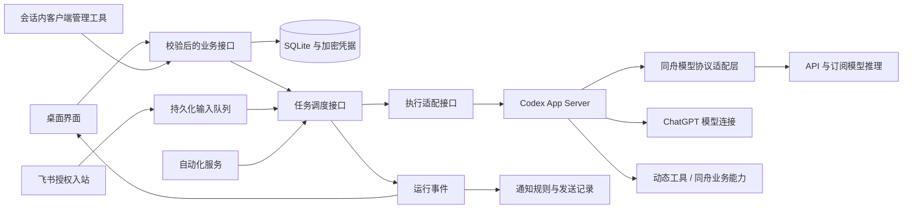

# 同舟架构

日期：2026-10-09。实现状态及验证边界见 [实施状态](IMPLEMENTATION_STATUS.md)、[验证记录](VALIDATION.md)。

## 调用关系

Electron 主进程持有数据库、网络、文件及引擎进程。React 仅经 preload 调用白名单业务方法；主窗口禁用 Node 集成，使用 contextIsolation 和 sandbox。外部网站在独立 BrowserWindow / Session 分区运行，不获得同舟 IPC。

## 模块

源码按 `electron/application`、`electron/core`、`electron/modules`、`electron/services` 分层，界面按 `src/features` 组织，完整目录和新增功能约定见 [代码目录与模块边界](CODE_STRUCTURE.md)。下表的文件名指对应目录中的实现。

客户端管理通过业务入口的注册元数据自动生成目录与调度：UI 和 Agent 调用同一个处理器，新增模块不维护工具白名单。参数、读写权限与本人操作入口随业务一起声明。详见 [客户端能力注册](CLIENT_CAPABILITIES.md)。模型和网络管理位于设置，代码托管认证位于插件，渠道集中管理机器人与通知连接。

| 文件                                                               | 职责                                                                  |
| ------------------------------------------------------------------ | --------------------------------------------------------------------- |
| `main.ts` / `preload.ts`                                           | IPC 来源校验、业务装配、系统入口                                      |
| `store.ts`                                                         | SQLite WAL、schema 2 迁移与一致备份、对象与消息顺序、重启恢复         |
| `task-scheduler.ts` / `context.ts`                                 | 可空 Agent、每会话单 Run、队列、取消、事件、引擎分段、只读团队        |
| `providers.ts`                                                     | 四类模型推理协议、SSE、公开思考、完成标记和用量                       |
| `codex.ts` / `codex-auth.ts`                                       | 锁定版本 App Server、官方登录与验证、超时及取消                       |
| `native-engine.ts` / `native-model.ts`                             | 官方登录、续期与模型目录；订阅凭据到推理协议的适配，不执行会话任务    |
| `model-gateway.ts`                                                 | 认证的本地 Responses 接口；只转换模型协议，不执行工具、压缩或任务重试 |
| `accounts.ts` / `account-paths.ts`                                 | 多账号隔离、认证状态与模型目录                                        |
| `connectors.ts` / `oauth-pkce.ts`                                  | GitHub device flow、GitLab PKCE / 刷新、身份检查和令牌生命周期        |
| `channels.ts` / `feishu.ts`                                        | Webhook、飞书扫码 / 应用消息 / WS、规则、幂等和入站绑定               |
| `extensions.ts` / `builtin-mcp.ts`                                 | 全局 MCP / Skills、目录缓存、延迟连接、内置网页与时间                 |
| `core/codex/execution.ts`                                          | Codex 动态工具目录、调用调度与当前任务作用域                          |
| `client-commands.ts`                                               | GUI 与会话共用的客户端查询、受审批的配置变更                          |
| `workspace.ts` / `project-init.ts`                                 | 搜索、读取、哈希修改、命令、路径检查、项目说明初始化                  |
| `computer.ts` / `computer-diagnostic.ts`                           | 各平台电脑操作、截图坐标和窗口绑定、本机功能自检                      |
| `src/features/connections/ConnectionsPage.tsx` / `RunActivity.tsx` | 渠道、机器人、通知与认证记录、公开运行过程和输入队列                  |

文件路径均相对 `electron/`，UI 文件除外。应用装配由 Cordis 插件组合，现有 preload 方法和数据格式保持兼容。

## Cordis 应用装配

锁定 `cordis@4.0.0-rc.10`。`main.ts` 负责 Electron 应用身份、窗口、安全设置、系统快捷键与启动/退出；`application/application.ts` 组装主进程应用，`application/kernel.ts` 封装 Cordis 生命周期。

- `application/services.ts` 声明基础服务插件，通过 `inject` 获取依赖、`ctx.provide()` 发布服务。存储、领域服务、任务执行、网络、认证与渠道按依赖顺序挂载；挂载时缺少依赖直接报错。
- `application/features/` 分功能注册项目、会话、知识、内容、模型账号、插件、权限及桌面操作。新增功能在 `application/features.ts` 中组合，主入口无需增加业务处理器。
- `application/context.ts` 定义服务类型。知识库、内容库、作品和任务服务通过独立依赖注入；模块注册函数接受所需的有限接口，任务操作通过 `tzTasks: TaskService` 调用，领域类型从各自模块定义；`tzEvents` 发布有类型的运行生命周期与账号失效事件。
- `application/client-ipc.ts` 将 IPC 和 Agent 能力目录作为同一 Cordis effect 注册。上下文释放时同时撤销两者；注册失败回滚目录，避免残留或重复入口。主窗口与主 frame 来源验证、参数验证、审批和凭据脱敏仍在原有边界执行。

退出先关闭新调用入口，停止并等待运行任务与进行中的业务调用，再按挂载顺序的逆序逐个等待插件释放，最后关闭数据库。启动失败也会释放已挂载资源。资源清理失败被汇总报告，其余服务继续清理；数据库不会提前于运行任务关闭。

### 任务与资源所有权

- `core/task-contracts.ts` 定义任务入口、执行适配、执行回调和网络接口。业务模块和渠道依赖所需的接口片段，不导入具体调度器或 Codex 执行实现。
- `core/runtime/task-scheduler.ts` 接收固定依赖，负责输入队列、并发、权限、取消和任务状态；`run-ledger.ts` 负责消息顺序、流式正文分段与进度落盘，`snapshot.ts` 负责状态投影。
- `application/task-system.ts` 创建会话生命周期、审批、终端、调度器和自动化；启动失败回滚，退出关闭生产者、等待任务和引擎释放、撤销事件订阅。任务调度不再构造业务服务，也不接收启动后的网络、项目或通知回写挂钩。
- `core/codex/execution.ts` 实现执行接口，独立持有活动客户端、steer 处理器和空闲线程缓存。取消通过 AbortSignal 传递；线程恢复、历史导入和协议转换留在适配器。
- `services/accounts/accounts.ts` 自行持有登录客户端。认证客户端不执行工具，与任务客户端分别释放；网络配置重置通过账号失效事件传递。网络实现先于任务装配，清理时晚于消费者释放。
- `modules/domain-services.ts` 创建共享知识、内容、附件、作品与变更持久化服务。业务操作使用这些服务的有限接口；通用 Store 与 Electron 对话框尚未全部迁移到仓储和宿主接口，后续范围见 [架构演进](ARCHITECTURE_TARGET.md)。

### 界面状态

`useApplicationState` 管理快照、提示和变更订阅，旧快照请求不能覆盖新结果；`useSessionMessages` 管理会话历史与流式消息合并，切换会话撤销旧请求结果；`useAccountState` 管理授权事件、账号状态和授权面板，查询结果不能覆盖更新的认证事件。`AgentsPage` 自行管理角色编辑状态。模型配置和登录面板继续位于 `src/features/connections/`。App 保留导航、工作台及尚未拆出的管理页面组合，未将所有会话控制逻辑拆完。

Cordis 当前只装配同舟内置可信模块；用户配置的 MCP 服务继续通过既有传输、认证与权限路径运行，没有任意 npm 插件加载器或插件市场。

本次不修改数据库 schema、用户数据位置、会话 ID 或外部协议。账号 OAuth 的实际登录、模型计费和渠道权限仍由各服务实现决定。

## 会话与恢复

Session 是产品事实来源，Run 冻结模型、账号、角色、权限和指令。Agent 可为空；基础执行上下文不要求固定规划流程。首个事件在模型回复前显示。公开思考和工具过程与正文分离，增量更新节流，结束时落盘；未知 Token 用量标记未上报。

输入先持久化再调度。所有模型均由 Codex 绑定 threadId / expectedTurnId / clientUserMessageId 进行 steer；线程尚未准备好的补充进入队列。送交结果不明的输入暂停，不自动重发。重启暂停未消费输入，运行中断，不重放工具。

同模型 / 账号 / 项目 / 指令 / 权限 / 工具目录且历史连续时，所有模型都恢复 Codex thread。空闲连接缓存有容量和超时限制；重启后按已完成片段的 threadId 恢复。配置改变或历史分叉时新建线程，一次性导入明确区分角色和真实工具记录的历史，原文仍可通过会话工具分段读取。

工具循环、长任务中的继续推理、自动上下文压缩和线程恢复由 Codex 管理。同舟不再运行 directRun / nativeRun，也不在活跃线程外另做一次历史压缩。模型网关每次只执行一次推理，工具结果经 Codex 进入下一次请求。订阅模型的私有思考签名按会话、账号、模型与调用 ID 保存，避免恢复后丢失原协议所需签名。应用退出不会自动重放尚未完成的工具；用户继续时沿已保存记录恢复。

默认模型上下文窗口为保守的 128000 tokens；已有手动字符设置按 4 字符约 1 token 转换为窗口（最低 4096），80% 处交给 Codex 自动压缩。这是兼容旧设置的预算，不代表服务商承诺的模型容量。上游上下文超限映射为标准错误供 Codex 处理。

删除要求会话已归档且父子会话均无运行任务；检查通过后标记父子会话停止接收输入，清理应用私有工作目录，事务删除关联对象；渠道入站绑定解除。独立分支和用户项目保留。schema 1 升级通过 `VACUUM INTO` 备份一致快照；只迁移未修改的原始角色种子，保留用户角色。

## 能力与权限

插件、Skills、电脑控制和客户端管理使用公共开关。运行开始建立目录快照，每次调用重新校验停用和配置变更；禁用可以收紧当前任务权限，启用不静默扩大当前目录。MCP 未发现时提供按需发现入口；已缓存工具按调用建立连接。Skills 先暴露简介，正文按需加载。

同舟业务能力以动态工具交给 Codex 调度，调用仍经过统一 ToolScope、权限、版本和落盘检查。项目会话可使用 Codex 原生项目工具；普通会话也使用 Codex 原生 Shell、补丁和图片查看工具，以会话专属目录为默认 cwd；用户指定路径时受当前 Codex 权限控制。只读与知识后台任务保持收紧。普通会话的持久终端仍可作为可见终端使用。记忆整理仅开放必要的记忆工具。禁用宿主机器上的自动 Skill 发现，避免绕过同舟的插件选择。切换模型不会切换权限执行实现。

MiniMax / Kimi 官方客户端仅用于设备登录、令牌刷新、注销和模型目录；不调用其 session/prompt。推理适配读取同舟自己管理的账号目录，校验地区、模型和官方服务地址，不扫描其他应用凭据。适配依赖锁定的官方客户端凭据格式，格式未知时明确报错，绝不回退到旧的 ACP 执行循环。模型网络请求使用账号对应的独立网络配置与统一 Tongzhou 标识。

文件工具拒绝越界与符号链接 / 联接，禁止直接写 `.git`。写入使用版本哈希、审批前后检查、进程内文件锁及临时文件替换，保留已有文件权限。命令提供增量输出、结构化退出码、最长 30 分钟限制及进程树取消。终端是审批后的当前用户命令执行，不能把目录检查当作 Shell 沙箱。

电脑操作要求先截图，坐标绑定窗口与 PID，一张截图仅供一次操作；窗口移动 / 关闭 / 截图过期则拒绝。自检只操作新建的同舟测试窗口，截图不发送外部服务。多 Agent 团队保持只读；不让并发写入团队共享目录。

## 认证与渠道

API / 连接器 / 渠道秘密通过系统安全存储加密；渲染层和会话工具只得到是否配置、身份和验证结果。Codex 执行记录与订阅账号使用同舟的私有 home，不扫描其他应用凭据。GitLab refresh token 加密保存，401 后刷新；配置更换站点时清除旧令牌。OAuth state、回调 Host / path、PKCE verifier、取消与超时受验证。

浏览器账号模块及其独立窗口、页面操作工具已移除。模型登录和代码托管插件保留各自的认证流程。

通知规则按全局 / 会话、事件和渠道计算。先记录 Delivery 和幂等键，再调用平台；一次性规则在发送前消费。平台业务码验证通过才标成功，超时 / 结果不明不自动重发。主动发送使用审批展示目标与文本。飞书入站仅接受启用的绑定、白名单真人、文字消息和去重后的事件；渠道消息不能代替本机工具审批。企业微信 / 钉钉本版为 Webhook 出站。

本机退出 / 休眠时无后台中继。真实第三方权限、Mac 授权与账号权益必须分别验收，详见验证报告。

## 会话与工作台业务

客户端操作在业务处理器旁声明参数、读写属性和确认策略，IPC 与 client_catalog/client_query/client_change 共用注册表。普通会话可以管理内容、目录、作品、偏好、记忆、技能与配置；后台任务继续使用有范围限制的专用工具。内容库写入复用持久化接口，返回真实文档 ID、版本、字符数与 SHA-256。新增及编辑不再有确认入库流程，删除业务数据始终走对话内确认，包括 full-access 会话。

磁盘文件的创建和修改使用 Codex 核心工具，不增加另一套通用文件执行器。内容库、作品导入导出保留必要业务接口，支持绝对路径参数；写磁盘文件不等于已进入内容库。入库后的版本、来源和索引由业务层维护。凭据输入、用户审批和权限提升仍由本人完成。

生成文件和附件都通过共享 WorkspaceFrame 在右侧预览，保留聊天输入与可调整宽度，不再创建预览弹窗。已删除作品申请入库工具与等待确认状态，不保留兼容别名。
