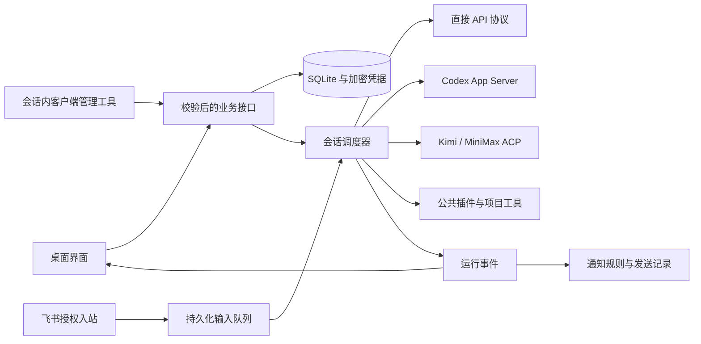

# 同舟 0.4 架构

日期：2026-10-03。实现状态及验证边界见 [实施状态](IMPLEMENTATION_STATUS.md)、[验证记录](VALIDATION.md)。

## 调用关系

Electron 主进程持有数据库、网络、文件及引擎进程。React 仅经 preload 调用白名单业务方法；主窗口禁用 Node 集成，使用 contextIsolation 和 sandbox。外部网站在独立 BrowserWindow / Session 分区运行，不获得同舟 IPC。

## 模块

| 文件                                           | 职责                                                           |
| ---------------------------------------------- | -------------------------------------------------------------- |
| `main.ts` / `preload.ts`                       | IPC 来源校验、业务装配、系统入口                               |
| `store.ts`                                     | SQLite WAL、schema 2 迁移与一致备份、对象与消息顺序、重启恢复  |
| `runtime.ts` / `context.ts`                    | 可空 Agent、每会话单 Run、队列、取消、事件、引擎分段、只读团队 |
| `providers.ts`                                 | 四类 API、SSE、公开思考、完成标记、用量、可移植历史与来源摘录  |
| `codex.ts` / `codex-auth.ts`                   | 锁定版本 App Server、官方登录与验证、超时及取消                |
| `native-engine.ts` / `native-policy.ts`        | ACP、独立私有 home、工具边界、初次引擎配置引导                 |
| `accounts.ts` / `account-paths.ts`             | 多账号隔离、认证状态与模型目录                                 |
| `connectors.ts` / `oauth-pkce.ts`              | GitHub device flow、GitLab PKCE / 刷新、身份检查和令牌生命周期 |
| `browser-profiles.ts`                          | 持久化浏览器分区、登录态清理、外部页面隔离                     |
| `channels.ts` / `feishu.ts`                    | Webhook、飞书扫码 / 应用消息 / WS、规则、幂等和入站绑定        |
| `extensions.ts` / `builtin-mcp.ts`             | 全局 MCP / Skills、目录缓存、延迟连接、内置网页与时间          |
| `tool-bridge.ts` / `tool-proxy.ts`             | 认证的 loopback 连接与 stdio MCP 适配                          |
| `client-commands.ts`                           | GUI 与会话共用的客户端查询、受审批的配置变更                   |
| `workspace.ts` / `project-init.ts`             | 搜索、读取、哈希修改、命令、路径检查、项目说明初始化           |
| `computer.ts` / `computer-diagnostic.ts`       | 各平台电脑操作、截图坐标和窗口绑定、本机功能自检               |
| `src/ConnectionsPanel.tsx` / `RunActivity.tsx` | 连接中心、渠道、认证记录、公开运行过程和输入队列               |

文件路径均相对 `electron/`，UI 文件除外。当前仍在小型代码库中按文件划分，没有为目录层级重写已有接口。

## 会话与恢复

Session 是产品事实来源，Run 冻结模型、账号、角色、权限和指令。Agent 可为空；基础执行上下文不要求固定规划流程。首个事件在模型回复前显示。公开思考和工具过程与正文分离，增量更新节流，结束时落盘；未知 Token 用量标记未上报。

输入先持久化再调度。直接 API 在请求边界消费补充；Codex 绑定 threadId / expectedTurnId / clientUserMessageId 进行 steer；ACP 无即时补充确认则排队。送交结果不明的输入暂停，不自动重发。重启暂停未消费输入，运行中断，不重放工具。

同模型 / 账号 / 项目 / 指令 / 工具目录且历史连续时，Codex 恢复 thread；Kimi / MiniMax 普通聊天复用会话和桥接进程。工具目录改变或模型 / 账号切换会使复用失效；新引擎收到可移植历史。warm bridge 只允许相同目录重新绑定新 ToolScope，关闭的 Scope 拒绝旧调用。

历史按完整用户轮次选取，超预算附带确定性的来源摘录，不产生额外模型调用，也不把历史工具输出提升为系统指令。原文保留，UI 按序号分页读取。单轮超过预算明确失败。历史分支复制当时记录，不复制排队任务或执行操作。

删除先标记父子会话停止接收输入，再取消并等待收尾，清理应用私有工作目录，事务删除关联对象；渠道入站绑定解除。独立分支和用户项目保留。schema 1 升级通过 `VACUUM INTO` 备份一致快照；只迁移未修改的原始角色种子，保留用户角色。

## 能力与权限

插件、Skills、电脑控制和客户端管理使用公共开关。运行开始建立目录快照，每次调用重新校验停用和配置变更；禁用可以收紧当前任务权限，启用不静默扩大当前目录。MCP 未发现时提供按需发现入口；已缓存工具按调用建立连接。Skills 先暴露简介，正文按需加载。

直接 API 和 ACP 使用同舟项目工具。Kimi / MiniMax 的私有配置限制未托管的原生工具，再经受控 MCP 桥调用文件 / 命令工具；不以 plan 模式代替权限。MiniMax 首次由官方 CLI 生成默认托管账号配置，再限制工具，避免空配置导致假授权。Codex 保留原生项目沙箱 / 审批；产品不宣称三个后端具备相同的操作系统沙箱。

文件工具拒绝越界与符号链接 / 联接，禁止直接写 `.git`。写入使用版本哈希、审批前后检查、进程内文件锁及临时文件替换，保留已有文件权限。命令提供增量输出、结构化退出码、最长 30 分钟限制及进程树取消。终端是审批后的当前用户命令执行，不能把目录检查当作 Shell 沙箱。

电脑操作要求先截图，坐标绑定窗口与 PID，一张截图仅供一次操作；窗口移动 / 关闭 / 截图过期则拒绝。自检只操作新建的同舟测试窗口，截图不发送外部服务。多 Agent 团队保持只读；不让并发写入团队共享目录。

## 认证、浏览器与渠道

API / 连接器 / 渠道秘密通过系统安全存储加密；渲染层和会话工具只得到是否配置、身份和验证结果。Codex 与 ACP 使用同舟的私有 home，不扫描其他应用凭据。GitLab refresh token 加密保存，401 后刷新；配置更换站点时清除旧令牌。OAuth state、回调 Host / path、PKCE verifier、取消与超时受验证。

浏览器 Cookie 存在不等于认证或模型权益。独立持久化分区只服务对应连接；清理删除该分区数据，不接触用户其他浏览器。原始 Cookie 不作为模型可读配置。

通知规则按全局 / 会话、事件和渠道计算。先记录 Delivery 和幂等键，再调用平台；一次性规则在发送前消费。平台业务码验证通过才标成功，超时 / 结果不明不自动重发。主动发送使用审批展示目标与文本。飞书入站仅接受启用的绑定、白名单真人、文字消息和去重后的事件；渠道消息不能代替本机工具审批。企业微信 / 钉钉本版为 Webhook 出站。

本机退出 / 休眠时无后台中继。真实第三方权限、Mac 授权与账号权益必须分别验收，详见验证报告。
