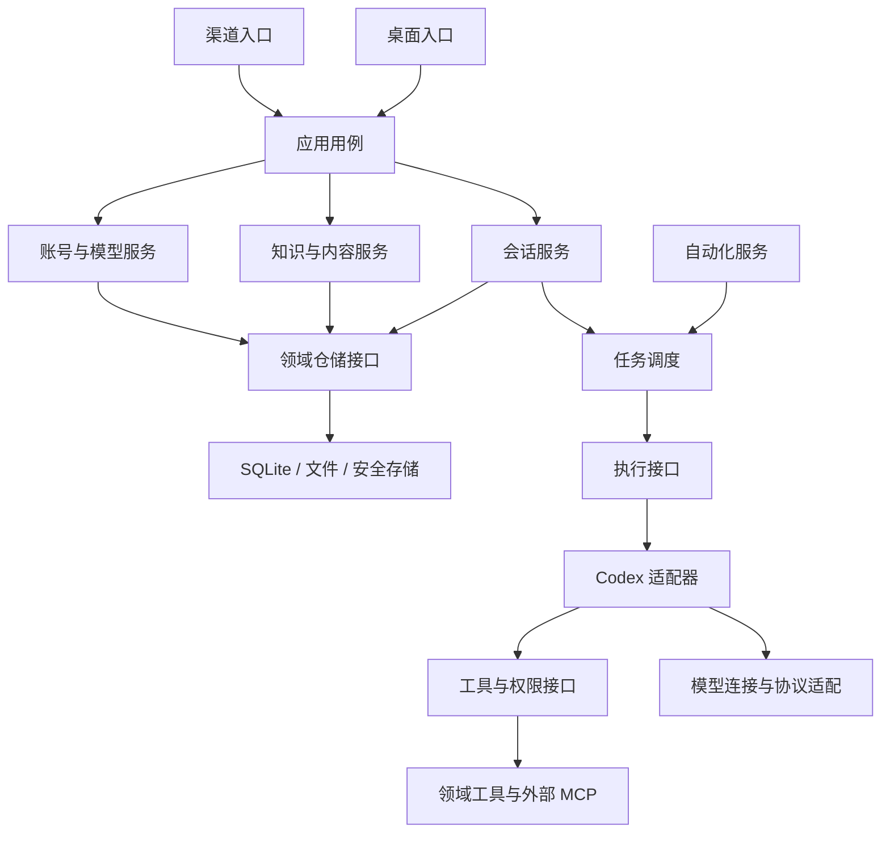

# 架构演进与实施范围

状态：第一阶段已实现并完成类型、构建及行为验证。重构前基线：2026-10-09，main `c904b3c`。本文分别记录已完成范围与后续目标。

## 产品目标

同舟在本机管理会话、知识、内容、记忆和作品；接入不同模型与订阅账号，保留同一会话的产品历史；通过已授权的渠道远程操作会话。知识持久化由同舟负责。渠道能力与真实账号权限按各平台分别实现和验收。

## 重构前的问题

- `application/context.ts` 的领域服务类型从 Runtime 推导；多个业务模块和基础服务仍引用 Runtime。它同时承担调度、执行实例、账号客户端、领域服务和状态投影，业务边界不足。
- Runtime 创建 Automations，Automations 又接收 Runtime；网络、项目和渠道服务启动后回写 Runtime 的回调。构造依赖、运行事件和资源所有权混在一起。
- Codex 的客户端、线程缓存和账号客户端仍由 Runtime 管理。现有 CodexExecution 已拆出执行代码，执行契约仍包含具体存储、缓存和会话实现。
- 业务注册层直接处理 Electron 对话框、磁盘文件和通用 Store。业务规则较难脱离桌面宿主验证。
- App 仍集中维护跨页面状态、会话状态、认证流程和弹窗协调。页面拆分之后，状态边界仍需拆分。

上一轮已改善启动、资源释放、接口注册和源码组织。这一轮以依赖方向和服务所有权为验收依据。

## 目标结构

Cordis 位于应用装配入口，负责创建实现、注入依赖、启动及释放资源。领域逻辑只依赖明确的接口。跨服务的命令使用显式调用；运行状态、领域变更和通知使用有类型的事件，每个订阅都登记释放逻辑。

| 边界         | 负责                                            | 约束                                                 |
| ------------ | ----------------------------------------------- | ---------------------------------------------------- |
| 会话         | 产品历史、输入受理、模型选择、分支与归档        | 引擎线程 ID 作为适配器记录；切换模型后仍保留产品会话 |
| 任务调度     | 排队、并发、取消、输入补充与运行状态            | 通过执行接口操作引擎；自动化和渠道使用同一入口       |
| 执行适配器   | 引擎进程、线程、恢复、推理与工具循环            | Codex 专有实现集中在适配器；支持性与恢复失败明确上报 |
| 模型与账号   | Token/OAuth、续期、身份校验、模型目录与协议适配 | 凭据留在主进程与安全存储；声明模型实际能力           |
| 工具与权限   | 工具目录、审批、只读限制、撤权和调用记录        | GUI 与 Agent 共用用例；每次调用校验当前授权          |
| 知识与内容   | 来源、正文、版本、索引、记忆与作品关联          | 通过领域仓储持久化；AI 整理调用任务接口              |
| 自动化与渠道 | 触发、幂等、入站身份与通知                      | 不持有完整执行实现；渠道输入不能替代本人审批         |
| 桌面与界面   | 窗口、文件选择、页面布局和交互状态              | 页面各自拥有状态；App 组合页面与共享导航             |

## 迁移顺序

1. 定义独立的任务、执行、事件、仓储与桌面交互接口；将直接依赖 Runtime 的模块迁移到实际需要的接口，并增加依赖边界检查。
2. 将自动化、终端、审批、会话生命周期和账号客户端的构造与释放迁移到各自服务；移除 Runtime 与服务间的回写挂钩。
3. 将执行客户端、线程缓存和协议字段收进 Codex 适配器。明确 start、steer、cancel、resume、事件与能力契约；通过契约测试验证行为，不新增未经验证的执行器。
4. 将业务用例中的 SQLite、磁盘和 Electron 操作迁移到领域仓储与宿主适配器；保留原接口、参数与确认策略。
5. 按会话、认证、知识、工作区拆分界面状态和控制逻辑，App 保留布局与导航装配。

## 整体目标的完成条件

- 领域模块与渠道模块不引用 Runtime 或具体 Codex 实现，服务类型不从 Runtime 推导。
- 自动化、渠道和界面经同一任务入口操作会话；Runtime 不再构造这些服务或接收启动后的可变挂钩。
- 引擎进程和缓存由执行适配器拥有，产品会话、权限与知识数据由同舟服务拥有。
- 依赖检查阻止领域向宿主和适配器反向引用；构建、现有能力目录及行为回归保持通过。
- 会话历史、模型切换、进行中权限切换、待审批操作、取消、重启恢复和服务退出均有实际行为验证。
- 清理旧实现与转发层；数据迁移如确有必要，单独设计备份、恢复和版本兼容。

## 本轮完成

- 独立 TaskService、ExecutionAdapter、ExecutionCallbacks、ExecutionNetwork 和类型化应用事件；移除领域、渠道对 Runtime 的引用以及 Context 从 Runtime 推导类型的做法。
- 删除原 Runtime 与 tzExecution 转发层，改为 TaskScheduler 接收固定依赖；自动化、审批、终端和会话生命周期由应用装配创建与释放，启动失败能够回滚。账号登录客户端迁入 Accounts。
- CodexExecution 迁入 `core/codex/execution.ts` 并独立持有活动客户端、steer 和空闲线程缓存；调度器只操作执行接口。消息和进度持久化归 RunLedger。
- 拆出应用快照、账号状态、会话消息钩子和 Agent 页面状态；移除 App 中对应的重复状态协调。
- 增加依赖边界与实际任务装配生命周期测试；保留原 preload、业务接口和数据结构，不引入旧路径兼容壳。

## 后续目标

迁移顺序中的仓储与宿主适配尚未完成：业务注册仍有通用 Store、磁盘和 Electron 依赖，Codex 适配器仍直接使用存储和工具作用域。App 尚有工作台、模型列表与跨页面控制逻辑。下一轮应按具体用例继续抽取，不增加空接口、通用服务基类或第二套事件总线。产品历史、权限、持久化和认证行为继续作为迁移约束。

## 本地文件与边界修正（2026-10-09）

- 文档、修订、目录、作品和附件迁入 `.tzhou` 文件仓库，删除知识正文数据库双写和持久化全文索引；保存只有文档原子替换这一个提交点。迁移、备份及故障测试见 [本地文件工作区](LOCAL_FILES.md)。
- 工具选择与装配由 `application/task-tools.ts` 提供，调度器通过 `TaskToolPreparation` 调用。调度器仍负责运行准备、权限变化及任务收尾，后续可按实际用例继续减小依赖。
- 内容、智库、作品的业务注册依赖 `DocumentHost`，桌面文件选择、导入读取、导出和打开由宿主适配器实现，不再直接导入 Electron。
- 导航状态与快捷键独立为 `useNavigation`；任务变更使用 `taskSnapshot`，不会读取模型、插件、账号等配置。快照读取串行合并，避免旧请求覆盖新状态。其他配置变更暂时仍刷新完整快照；App 中还有可继续拆分的跨页面交互，不宣称整体解耦已完成。
- 依赖检查统一处理 Windows / POSIX 路径，并覆盖禁止引用的反例。

### 机器人模块

- `src/features/bots/` 独立维护机器人页面与样式；资源与工具、内置应用插件均指向 `bots` 页面。
- `electron/application/features/bots.ts` 注册机器人配置、删除、重连和扫码授权接口，通知渠道插件不再依赖机器人服务。
- `tongzhou-bots-service` 继续独立管理连接生命周期；飞书平台授权服务供机器人与通知渠道复用。
- 机器人授权取消使用 `cancelBotLogin`，通知渠道使用 `cancelChannelLogin`；Agent 请求扫码时导航到机器人页面。
- 原有机器人配置与加密凭据保持原存储位置，不因页面拆分而重建或迁移。
- `services/bots/wecom-onboarding.ts` 隔离企业微信扫码协议：采用官方授权页 `/ai/qc/gen` 使用的二维码生成和轮询接口，来源为 `tongzhou`，凭据仅在主进程交给机器人服务加密保存。授权不会直接开启远程执行。
- 企业微信扫码端点属于官方网页授权流程，不是长连接 SDK 的稳定接口；模块独立维护并保留手动 Bot ID / Secret 配置。五分钟过期、取消、网络重试及插件释放都终止对应轮询，过期或取消后的响应不得落库。
